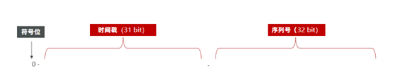
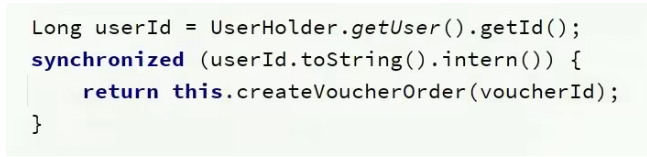

# 黑马点评笔记心得


## 开篇


* 短信登陆


主要是通过 Redis 取代 session 完成短信登录。

* 商户缓存


缓存不一致、（不存在的 key ）穿透、（热点 key ）击穿、（ Redis 宕机、Redis key 大量失效）雪崩

* 秒杀


锁，事务，Lua，分布式锁，消息队列

* 附近商户

GEOhash

* UV

HyperLogLog

* 签到

BitMap

* 关注

Set

* 达人探店

List，点赞：SortedSet


## 短信登录


### 1.1 NGINX


### 1.2 基于Session 登录流程


**发送验证码：**

* 验证手机号
* 存，发验证码

**短信登录注册**

* 用户输入：手机号、验证码
* session 拿验证码 与用户的比
* 查手机号
* 登录 或 创建用户

**校验登录状态**

* *用户请求，从 cookies 中拿 Jssessionid 。(无体现)*
* 拦截器拿session
* 从 session 取用户
* 有，存用户到 threadlocal
* 无，拦截

 

### 1.3 基于 Session 实现登录


* 发验证码

```java
// 1.校验手机号
        if (RegexUtils.isPhoneInvalid(phone)) {       

// 3.符合，生成验证码
        String code = RandomUtil.randomNumbers(6);
```

> RegexUtils 正则表达式工具类
>
> RandomUtil 是 Hutool 的工具类


### 1.4 登录拦截


**tomcat**

1. 用户请求，到 tomcat 中我们注册的端口，监听线程创建两个 socket， 用户向其中一个传数据。
2. tomcat 收了数据后，从 tomcat 线程池取一个线程执行请求，访问工程中的东西，最后统一返回。
3. tomcat 的 socket 将数据写回用户的 socket。

> 请求都由单独线程处理 独立，可用 threadlocal 存线程数据

**threadlocal**


* 拦截器代码

```java
public class LoginInterceptor implements HandlerInterceptor {

    @Override
    public boolean preHandle(HttpServletRequest request, HttpServletResponse response, Object handler) throws Exception {
       //1.获取session
        HttpSession session = request.getSession();
        //2.获取session中的用户
        Object user = session.getAttribute("user");
        //3.判断用户是否存在
        if(user == null){
              //4.不存在，拦截，返回401状态码
              response.setStatus(401);
              return false;
        }
        //5.存在，保存用户信息到Threadlocal
        UserHolder.saveUser((User)user);
        //6.放行
        return true;
    }
}
```

* 拦截器生效

```java
@Configuration
public class MvcConfig implements WebMvcConfigurer {

    @Resource
    private StringRedisTemplate stringRedisTemplate;

    @Override
    public void addInterceptors(InterceptorRegistry registry) {
        // 登录拦截器
        registry.addInterceptor(new LoginInterceptor())
                .excludePathPatterns(
                        "/shop/**",
                        "/voucher/**",
                        "/shop-type/**",
                        "/upload/**",
                        "/blog/hot",
                        "/user/code",
                        "/user/login"
                ).order(1);
```

> excludePathPatterns 是白名单


### 1.5 去用户敏感信息 用 USERDTO


* 存 session
* 存 threadlocal


### 1.6 session 问题


多台tomcat，要存多分session

1. 延迟
2. 服务器每份都存，压力大


### 1.7 Redis 改写


优点：

1. 支持跨域

2. 无状态
3. 解耦
4. 适合跨平台


#### 1.7.1 key结构


key 用随机 token ，前端 token 存  localStorage。（最后还是 Redis 存了手机号，做了校验码，还是敏感信息存储了）


#### 1.7.3 流程


**发送验证码：**

* 验证手机号
* Redis 存手机号 验证码，发验证码

**短信登录注册**

* 用户输入：手机号、验证码
* Redis 拿验证码 与用户的比
* 查手机号 （ 数据库 ）
* 登录 或 创建 用户
* 用户信息存 Redis, key 为 token。（可用 String, hash）

**校验登录状态**

* 拦截器拿 token
* 从 Redis 取用户
* 有，存用户到 threadlocal
* 无，拦截


### 1.8 Redis 实现代码


```java
    // 3.从redis获取验证码并校验
    String cacheCode = stringRedisTemplate.opsForValue().get(LOGIN_CODE_KEY + phone);

    // 4.一致，根据手机号查询用户 select * from tb_user where phone = ?
    User user = query().eq("phone", phone).one();

    // 7.1.随机生成token，作为登录令牌
    String token = UUID.randomUUID().toString(true);

    // 7.4.设置token有效期
    stringRedisTemplate.expire(tokenKey, LOGIN_USER_TTL, TimeUnit.MINUTES);
```

> query().eq("phone", phone).one(); 是 mybatis-plus


### 1.9 解决状态登录刷新问题


双拦截器


**第一个:**

* 获取 token

```java
 // 1.获取请求头中的token
        String token = request.getHeader("authorization");
        if (StrUtil.isBlank(token)) {
            return true;
        }
```

* 查 Redis 用户

```java
// 2.基于TOKEN获取redis中的用户
        String key  = LOGIN_USER_KEY + token;
        Map<Object, Object> userMap = stringRedisTemplate.opsForHash().entries(key);
// 3.判断用户是否存在
        if (userMap.isEmpty()) {
            return true;
        }
```

* 存 threadlocal

```java
// 6.存在，保存用户信息到 ThreadLocal
        UserHolder.saveUser(userDTO);
```

* 刷 token 有效期

```java
 // 7.刷新token有效期
        stringRedisTemplate.expire(key, LOGIN_USER_TTL, TimeUnit.MINUTES);
```

* 放行

**第二个：**

* 查 threadlocal 用户是否存在 

```java
 // 1.判断是否需要拦截（ThreadLocal中是否有用户）
        if (UserHolder.getUser() == null) {
```


## 商户查询缓存


#### 2.1.1 为什么用缓存


缓存可以大大降低**用户访问并发量带来的**服务器读写压力


#### 2.1.2 缓存类型


* 浏览器缓存
* tomcat、Redis 缓存
* 数据库缓存 buffer pool，
* cpu缓存 


#### 2.2.2 代码


* 查缓存
* 有，读
* 无，读库，更新缓存


## 2.3 缓存更新策略


内存淘汰，超时剔除，主动更新


### 2.3.1 数据库缓存不一致


**Cache Aside Pattern 人工编码方式**：缓存调用者在更新完数据库后再去更新缓存，也称之为双写方案

**Read/Write Through Pattern** : 由系统本身完成，数据库与缓存的问题交由系统本身去处理

**Write Behind Caching Pattern **：调用者只操作缓存，其他线程去异步处理数据库，实现最终一致


选第一种：

* 更新缓存，无效写多，不如删除缓存

* 先查数据库，后删缓存


## 2.4 实现双写一致


* 设置 redis 过期时间 （超时剔除）
* 修改库后删缓存 （ 2 和 3 是主动更新）（要加事务标签，防止单线程下不一致，最容易排除的不一致）
* 查询若没有，从 mysql 导入最新数据（之前已经有了）


## 2.6 缓存穿透


* 布隆过滤
  * 用 hash （可能判断存在，但不存在，hash碰撞）
  * 实现复杂
* 缓存空对象
  * 如果是不同的随机 key ，大量额外内存消耗（设置较短的过期时间）
* 增加id强度
* 数据校验
* 权限校验
* 数据限流

缓存空对象实现 ：

* mysql 不存在，则 key 存入 redis , value 为空。


## 2.7 缓存雪崩


* key 的 ttl 加随机值
* redis 集群
* 业务加多级缓存
* 业务加降级限流策略


## 2.8 缓存击穿


* 互斥锁  （一个线程拿到了锁，别的线程tryLock, double check ）

> setnx 实现互斥锁，delete 释放锁

* 逻辑过期 （一个线程拿到了锁，别的线程返回旧数据）


## 3.0 逻辑过期实现


* 未命中返回空***（这样那我要是向数据库插入新数据怎么办？？）***（可能在前端对热点key和普通key有着不同的请求路径）
* 命中，判断是否过期

```java
 LocalDateTime expireTime = redisData.getExpireTime();
    // 5.判断是否过期
    if(expireTime.isAfter(LocalDateTime.now())) {
        // 5.1.未过期，直接返回店铺信息
        return shop;
    }
```

* 获取锁写入tryLock


# 3 优惠券秒杀


## 全局唯一ID


* 全局ID明显，会让用户猜出业务的信息
* 表单过大后，拆分表单，也要保证不同表单id的唯一性

**全局id生成器**



符号位：永远是0

时间戳：31 bit,可以用69年，秒为单位

序列号：32bit， 每秒可产生2^32个不同的ID


## 3.2 Redis实现


开始时间戳

```java
 /**
     * 开始时间戳
     */
    private static final long BEGIN_TIMESTAMP = 1640995200L;

 // 1.生成时间戳
        LocalDateTime now = LocalDateTime.now();
        long nowSecond = now.toEpochSecond(ZoneOffset.UTC);
        long timestamp = nowSecond - BEGIN_TIMESTAMP;

  // 2.生成序列号
        // 2.1.获取当前日期，精确到天
        String date = now.format(DateTimeFormatter.ofPattern("yyyy:MM:dd"));
        // 2.2.自增长
        long count = stringRedisTemplate.opsForValue().increment("icr:" + keyPrefix + ":" + date);

        // 3.拼接并返回
        return timestamp << COUNT_BITS | count;
```

> localDateTime 是java8 自带的

* countDownLatch

```java
 CountDownLatch latch = new CountDownLatch(300);

    Runnable task = () -> {
        for (int i = 0; i < 100; i++) {
            long id = redisIdWorker.nextId("order");
            System.out.println("id = " + id);
        }
        latch.countDown();
    };
    long begin = System.currentTimeMillis();
    for (int i = 0; i < 300; i++) {
        es.submit(task);
    }
    latch.await();
    long end = System.currentTimeMillis();
    System.out.println("time = " + (end - begin));
```


## 3.3 添加优惠券


增加普通

```java
@PostMapping
public Result addVoucher(@RequestBody Voucher voucher) {
```

增加秒杀

```java
@PostMapping("seckill")
public Result addSeckillVoucher(@RequestBody Voucher voucher) {
```

保存秒杀

```java
 // 保存优惠券
    save(voucher);
    // 保存秒杀信息
    SeckillVoucher seckillVoucher = new SeckillVoucher();
    seckillVoucher.setVoucherId(voucher.getId());
    seckillVoucher.setStock(voucher.getStock());
    seckillVoucher.setBeginTime(voucher.getBeginTime());
    seckillVoucher.setEndTime(voucher.getEndTime());
    seckillVoucherService.save(seckillVoucher);
    // 保存秒杀库存到Redis中
    stringRedisTemplate.opsForValue().set(SECKILL_STOCK_KEY + voucher.getId(), voucher.getStock().toString());
}
```


## 3.4 实现秒杀下单


下单时需要判断两点：

* 秒杀是否开始或结束，如果尚未开始或已经结束则无法下单
* 库存是否充足，不足则无法下单


## 3.5 超卖


加锁：

* 乐观锁
* 悲观锁

**乐观锁** ：库存和查询的库存一致，只有一个人可以扣减成功，成功率低：改进：验证stock > 0 （数据库行级锁）

```java
boolean success = seckillVoucherService.update()
            .setSql("stock= stock -1") //set stock = stock -1
            .eq("voucher_id", voucherId).eq("stock",voucher.getStock()).update(); //where id = ？ and stock = ?
```

```java
 .eq("voucher_id", voucherId).update().gt("stock",0); //where id = ? and stock > 0
```


## 3.6 一人一单


判断订单表里是否已经有用户，有了就不让买了。（ count() > 0 ）


只让一个相同id进来操作：



1. intern()

toString() 会 new 不同的对象，要使用 intern() ， 从常量池拿数据，保证锁的是同一把。

2. 用代理对象

事务失效：在同一个类中，一个方法调用另一个加事务标签的方法时，事务会失效，因为实际是创建了代理去执行事务。

	3. 将过程包裹起来

锁会包裹起来。


## 3.7 集群并发


锁会失效

每个 tomcat 都有自己的 jvm，不同服务器中，锁的对象不同，会syn失效


## 4.0 分布式锁


可见性，互斥，高可用，高性能，安全性

Redis: setnx

Zookeeper: 


