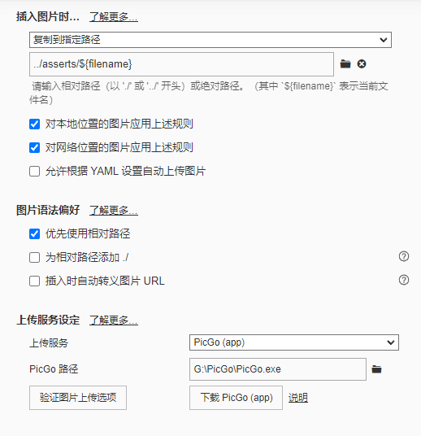

# 这是一个git 连接 typora 的测试

首先，我想先测试一下我的图床工具是否可以正常的使用。

这是可以正常使用的，非常的nice！

git 上有 小问题 ， 再测试一次

截屏快捷键： win+shift+s

success.

图床等以后再研究。

成功的配置：

再次测试图床：

!

](https://raw.githubusercontent.com/csfox/pictures/main/image-20230419134555743.png)

这咋不显示呢

!

](https://raw.githubusercontent.com/csfox/pictures/main/image-20230419134620772.png)